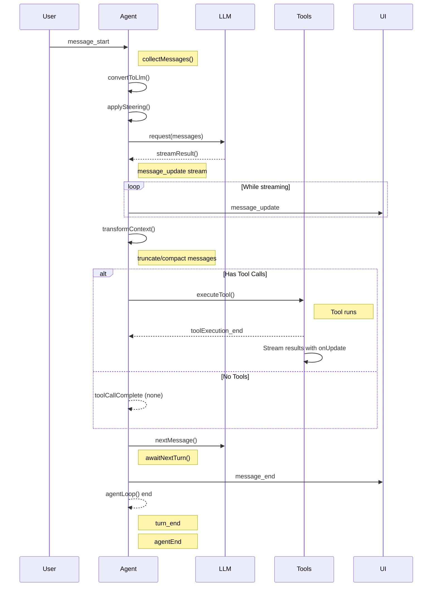

# Agent Runtime Event Flow

> [!NOTE] Event Sequence
> User interaction triggers a complete event loop from message_start to agent_end.

## Complete Event Sequence



## Event Categories

| Event Type | When Triggered | Description |
|-----------|----------------|-------------|
| `message_start` | User sends message | Collects messages, sets initial state |
| `message_update` | LLM streaming | Shows partial responses to user |
| `message_end` | Message complete | LLM finished processing |
| `turn_end` | Between turns | Marks completion of one turn |
| `agent_start` | First user message | Beginning of agent operation |
| `agent_end` | After n loops | Agent run complete after n turns |
| `tool_execution_*` | Tool calls | Progress events during tool execution |

## State Lifecycle

```
Idle → Active → Streaming → Tooling → Processing → Completion
     ↓         ↓          ↓        ↓           ↓             ↓
Init     start         update   execute    next message   end
messages   messages    messages  results   messages    loop stop
```

## Message Collection

```typescript
collectMessages() → messages: Array
```

- Called at `message_start`
- Gathers all messages for this turn
- Used in `convertToLlm()` and `transformContext()`

---

[[Architecture Overview]] &nbsp;&nbsp; &nbsp; [[Hooks & Callbacks]]
